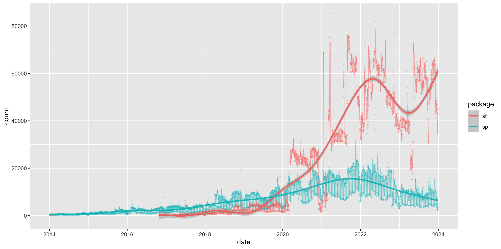
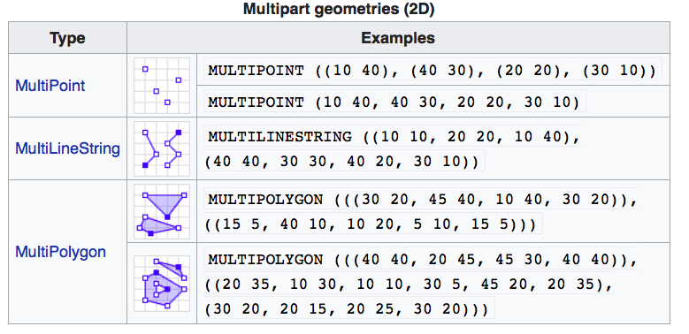
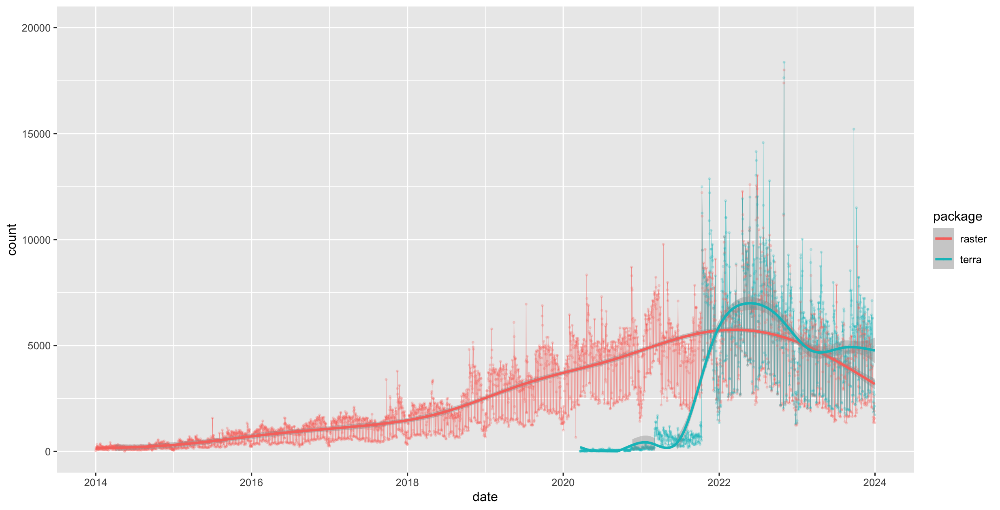

```{r, echo=FALSE, purl=FALSE, message=FALSE}
knitr::opts_chunk$set(results='hide', comment = "#>", purl = FALSE)

## libraries needed for R code examples
library(terra)
library(sf)
library(tidyverse)
```

# Introduction to spatial data in R {#intro}

> Learning Objectives
> 
> * Read table with geo coordinates into `sf` object
> * Read shapefiles into `sf` object
> * Examine `sf` objects
> * Use base plot with `sf` objects and attribute data
> * Read GeoTiff single and multiband into a `SpatRaster` object
> * Examine `SpatRaster` objects

--------------


## The `sf` package

The [`sf`](https://cran.r-project.org/package=sf)[^3] package was first released on CRAN in late October 2016, and has in the mean time superseded the original R Package for storing and manipulating spatial data, [`sp`](https://CRAN.R-project.org/package=sp ), which was first released in 2005. `sp` is still actively maintained, but less often used now, so you should be aware of it, but we will not teach it here. 

```{r spsf-dl, echo=FALSE, results='asis', out.width='100%', fig.cap='sf vs sp downloads on CRAN'}

```

`sf` implements a formal standard called ["Simple Features"](https://en.wikipedia.org/wiki/Simple_Features) that specifies a storage and access model of spatial geometries (point, line, polygon). A feature geometry is called simple when it consists of points connected by straight line pieces, and does not intersect itself. This standard has been adopted widely, not only by spatial databases such as PostGIS, but also more recent standards such as GeoJSON. 

[^3]: E. Pebesma & R. Bivand (2016)[Spatial data in R: simple features and
future perspectives](http://pebesma.staff.ifgi.de/pebesma_sfr.pdf)

If you work with PostGis or GeoJSON you may have come across the [WKT (well-known text)](https://en.wikipedia.org/wiki/Well-known_text) format (Fig 1.1 and 1.2) 

```{r wkt-primitives, echo=FALSE, results='asis', out.width='100%', fig.cap='Well-Known-Text Geometry primitives  (wikipedia)'}
knitr::include_graphics('img/wkt_primitives.png')
```

```{r wkt-multipart, echo=FALSE, results='asis', out.width='100%', fig.cap='Well-Known-Text Multipart geometries (wikipedia)'}

```

`sf` implements this standard natively in R.  In `sf` spatial objects are stored as a tabular format (data frame) with a special column that contains the information for the geometry coordinates. That special column holds a list with the same length as the number of rows in the data frame. Each of the individual list elements then can be of any length needed to hold the coordinates that correspond to an individual feature.  


`sf` objects are built up using the following structures:

1. `sfg` - simple feature geometry (one feature)
2. `sfc` - simple feature collection (a collection of `sfg`)
3. `sf` - simple feature object (`sfc` with data attributes)

So to create a spatial `sf` object manually the basic steps would be:  

> **I. Create geometric objects (topology)**

Geometric objects (simple features) can be created from a numeric vector, matrix or a list with the coordinates. They are called `sfg` objects for Simple Feature Geometry.b There are functions that help create simple feature geometries, like `st_point()`, `st_linestring()`, `st_polygon()` and more.

> **II. Combine all individual single feature objects for the special column.** 

The feature geometries are then combined into a Simple Feature Collection with `st_sfc()`. which is nothing other than a simple feature geometry list-column. The `sfc` object also holds the bounding box and the projection information.

> **III. Add attributes**. 

Lastly, we add the attributes to the the simple feature collection with the `st_sf()` function. This function extends the well known data frame in R with a column that holds the simple feature collection.

To create a network of highways we would first generate LINESTRINGs as simple feature geometries out of a matrix with coordinates:

```{r sfg-line, results='show'}
lnstr_sfg1 <- st_linestring(matrix(runif(6), ncol=2)) 
lnstr_sfg2 <- st_linestring(matrix(runif(6), ncol=2)) 
class(lnstr_sfg1)
```

We would then combine this into a simple feature collection :
```{r sfc-line, results='show'}
(lnstr_sfc <- st_sfc(lnstr_sfg1, lnstr_sfg2)) 
```

And lastly create a data frame from above to generate the `sf` object:

```{r sf-line, results='show'}
dfr <- data.frame(id = c("hwy1", "hwy2"), 
                  cars_per_hour = c(78, 22))
(lnstr_sf <- st_sf(dfr , lnstr_sfc))
```


There are many methods available in the `sf` package, to find out use

```{r sf-methods, results='show', warning=FALSE}
methods(class="sf")
```

Here are some of the other highlights of `sf` you might be interested in:

- provides **fast** I/O, particularly relevant for large files 
- spatial functions that rely on GEOS and GDAL and PROJ external libraries are directly linked into the package, so no need to load additional external packages (like in `sp`)
- `sf` objects can be plotted directly with `ggplot` 
- `sf` directly reads from and writes to spatial **databases** such as PostGIS
- `sf` is compatible with the [`tidyvderse` approach](https://www.tidyverse.org/), (but see some [pitfalls here](https://geocompr.github.io/geocompkg/articles/tidyverse-pitfalls.html))

Note that `sp` and `sf` are not the only way spatial objects are conceptualized in R. Other spatial packages may use their own class definitions for spatial data (for example `spatstat`). 

There are packages specifically for the [GeoJSON](https://tools.ietf.org/html/rfc7946) and for that reason are more lightweight, for example [`geojson`](https://cran.r-project.org/package=geojson)

Usually you can find functions that convert objects to and from these formats.

> <h3>Challenge</h3>
>
> Generate an `sf` point object.
>
> 1. Create a matrix `pts` of random numbers with two columns and as many rows as you like. These are your points.
> 2. Create a dataframe `attrib_df` with the same number of rows as your `pts` matrix  and a column that holds an attribute. You can make up any attribute.
> 3. Use the appropriate commands and `pts` an `sf` object with a gemoetry column of class `sfc_POINT`.
> 4. Try to subset your spatial object using the attribute you have added and the way you are used to from regular data frames.
> 5. How do you determine the bounding box of your spatial object?

```{r eval=FALSE, echo=FALSE}
# Answer

pts <- matrix(runif(20), ncol=2) # the matrix with the points
attrib_df <- data.frame(an_attribute = rep(LETTERS[1:5], each = 2)) # attribute table 

## sf approach ##
pts_sfg_list <- lapply(seq_len(nrow(pts)), function(i) st_point(pts[i,])) # a simple feature geometry
pts_sfc <- st_sfc(pts_sfg_list)     # a simple feature collection 
pts_sf <- st_sf(pts_sfc, attrib_df) # an sf object
pts_sf

# Subsetting
pts_sf$an_attribute # column with attribute only -- this is a vecor
subset(pts_sf, an_attribute == "A")  # subset with attribute A -- this is an SF object

# bounding box:
st_bbox(pts_sf)
```


## Creating a spatial object from a lat/lon table

Often in your research might have a spreadsheet that contains latitude, longitude and perhaps some attribute values. You know how to read the spreadsheet into a tabular format (tibble) with `dplyr::read_table` or `dplyr::read_csv`. We can then very easily convert the table into a spatial object in R.

An `sf` object can be created from a data frame in the following way. We take advantage of the `st_as_sf()` function which converts any foreign object into an `sf` object. Similarly to above, it requires an argument `coords`, which in the case of point data needs to be a vector that specifies the data frame's columns for the longitude and latitude (x,y) coordinates. 

    my_sf_object <- st_as_sf(myDataframe, coords)

`st_as_sf()` creates a new object and leaves the original data frame untouched.

We use `read_csv()` to read `philly_homicides.csv` into a tibble in R and name it `philly_homicides_df`.

```{r read-df, results='show'}
philly_homicides_df <- read_csv("data/philly_homicides.csv")
```

We convert the `philly_homicides_df ` data frame into an `sf` object with `st_as_sf()`

```{r df-to-sf, results='show'}
library(sf)

philly_homicides_sf <- st_as_sf(philly_homicides_df, coords = c("POINT_X", "POINT_Y"))
names(philly_homicides_sf)
```

Note the additional **geometry** list-column which now holds the simple feature collection with the coordinates of all the points. We now use `st_crs()` to check on the projection. 

```{r sf-nocrs, results='show'}
st_crs(philly_homicides_sf)
```

To make it a complete geographical object we use `st_set_crs()` to assign the WGS84 projection, which has the EPSG code 4326: 

```{r sf-crs, results='show'}
philly_homicides_sf %>% st_set_crs(4326)
st_crs(philly_homicides_sf)
```

Wow this is long. It is usually more helpful to just retrieve the proj4string:
```{r sf-crs-short, results='show'}
st_crs(philly_homicides_sf)$proj4string
```


We will save this object as a shapefile on our hard drive for later use. (Note that by default `st_write` checks if the file already exists, and if so it will not overwrite it. If you need to force it to overwrite use the option `delete_layer = TRUE`.)

```{r sf-save-homicides, eval=FALSE}
st_write(philly_homicides_sf, "data/PhillyHomicides", driver = "ESRI Shapefile")
# to force the save: 
st_write(philly_homicides_sf, "data/PhillyHomicides", driver = "ESRI Shapefile", delete_layer = TRUE)
```


## Loading shape files into R

`sf` relies on the powerful [GDAL library](http://gdal.org), which is automatically linked in when loading `sf`. The GDAL provides the  functionality to read and write spatial files of many formats. For shape files we can use `st_read()`, which simply takes the path of the directory with the shapefile as argument. 


```{r read-shp-sf, eval=TRUE, results='show'}
# read in
philly_sf <- st_read("data/Philly/")

# take a look at what we've got
str(philly_sf) # note again the geometry column
```

Two more words about the geometry column: Though it is not recommended, you can name this column any way you wish. Secondly, you can remove this column and revert to a regular, non-spatial data frame at any dime with `st_drop_geometry()`.

The default `plot` of an `sf` object is a multi-plot of the first attributes, with a warning if not all can be plotted:

```{r plot-shp-sf, eval=TRUE, results='show'}
plot(philly_sf)
```

In order to only plot the polygon boundaries we need to directly use the geometry column. We use the `st_geometry()` function to extract it:

```{r plot-shp-sfg, eval=TRUE, results='show'}
plot(st_geometry(philly_sf))
```

Let's add a subset of polygons with only the census tracts where the median houshold income (*medHHinc*) is more than $60,000. We can extract elements from an `sf` object based on attributes using the dplyr filter function (base R subsetting also works) and add the census tracts to the plot in a different color.

```{r pipe-subset-plot-shp-sfg, eval=TRUE}
plot(st_geometry(philly_sf))
philly_sf %>% 
  filter(medHHinc > 60000) %>% # filter for high income
  st_geometry() %>% # extract the geometry for plotting
  plot(col="red", add=T) # add to the plot
```


## Raster data in R

Raster files, as you might know, have a more compact data structure than vectors. Because of their regular structure the coordinates do not need to be recorded for each pixel or cell in the rectangular extent. A raster is defined by:

- a CRS 
- coordinates of its origin 
- a distance or cell size in each direction 
- a dimension or numbers of cells in each direction
- an array of cell values 

Given this structure, coordinates for any cell can be computed and don't need to be stored. 

`terra` was first released in 2020 and now replaces the `raster` package which was first released in 2010. `terra` has greater functionality, is faster and easier to use.

```{r raster-terraDownloads, echo=FALSE, results='asis', out.width='100%', fig.cap='raster vs terra downloads on CRAN'}

```

The `terra` package has functions for creating, reading, manipulating, and writing raster data. The package also implements raster algebra and many other functions for raster data manipulation.

The package works with `SpatRaster` objects. The `rast()` function is used to create these objects. For example, to create a raster object from scratch we would do the following:

```{r tidy=F, results='show'}

library(terra)
r <- rast(nrows=20, ncols=20, # number of cells in x and y dimension
          xmin=0, xmax=360) # min and max x coordinates (left-right borders)
r
```

From the output above we know that:
- the object is of class `SpatRaster`
- its dimensions are 20x20 cells
- it has one layer (band)
- the extent of the raster
- it __has a CRS defined!__ If the crs argument is missing when creating the SpatRaster object, if the x coordinates are within -360 and 360 and the y coordinates are within -90 and 90, the WGS84 projection is used by default. 

Good to know.

There are functions to look at individual properties of the raster object. For examle for the number of cells:

```{r raster-cells, results='show'}
ncell(r)
```

Or we can retrieve just the number of bands using the `nlyr()` function.

```{r n-bands, results='show'}
nlyr(r)
```


We can also find out about the Coordinate Reference System (CRS) with the `crs` function. The default output looks a little messy:

```{r raster-crs, results='show'}
crs(r)
```

We can make this easier to read by setting the proj argument:

```{r raster-crsprj, results='show'}
crs(r, proj = TRUE) # return the PROJ-string notation
```


Let's try and plot this. 

```{r tidy=F, eval=FALSE}
plot(r)
```

The canvas is empty! This is because even though we have a layer, the cells do not have any values. 


```{r tidy=F, eval=FALSE}
values(r)
```

To add some random values to the cells we can take advantage of the `ncells()` function and do this:

```{r tidy=F, results='show'}
values(r) <- runif(ncell(r))
r 
```

In addition  to the output above, we now see:
- the source, which indicates where the cell values are stored (here they are in memory)
- the range of the cell values (min value adn max value) now added. 
- the name, of the layer which is by default lyr.1.


This now plots successfully:

```{r tidy=F, results='show'}
plot(r)
```

(The [`rasterVis` package](https://cran.r-project.org/web/packages/rasterVis/index.html) provides a set of methods for enhanced visualization and interaction for more advanced plotting of raster objects.) 

`SpatRaster` objects can also be created from a matrix.

```{r volcano-raster, results='show'}
class(volcano)
volcano.r <- rast(volcano)
class(volcano.r)
```

We also use the `rast()` function to read in a raster file. This raster is generated as part of the [NEON Harvard Forest field site](https://www.neonscience.org/field-sites/field-sites-map/HARV). 

```{r read-raster, results='show'}
HARV <- rast("data/HARV_RGB_Ortho.tif")
```

Typing the name of the object will give us what's in there: 

```{r show-raster, results='show'}
HARV
```

> <h3>Challenge</h3>
>
> Based on the output above answer the following questions:
>
> 1. How many bands?
> 2. What are the names of the bands)?
> 3. Where are the cell values stored?
> 4. What is the CRS?


We can plot the object like this:

```{r plot-raster, results='show'}
plot(HARV)
```

Or to plot a single band:

```{r plot-raster-single, results='show'}
plot(HARV, 3)
```


We can also use the `rast()` function to import one single band:

```{r one-multiband, results='show'}
HARV_Band2 <- rast("data/HARV_RGB_Ortho.tif", lyrs = 2)
plot(HARV_Band2)
```


Let's now explore the distribution of values contained within our raster using the `hist()` function which produces a histogram. Histograms are often useful in identifying outliers and bad data values in our raster data.

```{r n-hist, results='show'}
hist(HARV)
```

Notice that a warning message is produced when R creates the histogram. By default the maximum cells processed per band is 1,000,000. This maximum value is to ensure processing efficiency as our data become larger. We can force the `hist` function to use all cell values.

```{r n-hist-allvals, results='show'}
ncell(HARV)
hist(HARV, maxcell = ncell(HARV))
```

At times it may be useful to explore raster metadata before loading them into R. This can be done with the function `describe()` 

```{r describe, results='show'}
describe("data/HARV_RGB_Ortho.tif")
```

For the many functions available for working with such an object see:

```{r raster-methods, results='show'}
methods(class=class(HARV))
```

